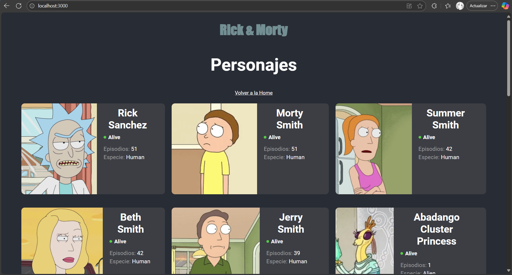

# Dockerización y CI de la aplicación React

Este repositorio contiene una aplicación React (Create React App) dockerizada y un flujo de CI para construir y publicar la imagen en Docker Hub mediante GitHub Actions.

## 1. Qué se hizo

- Dockerfile con build:
	- Etapa de build con `node:18-alpine` que ejecuta `npm ci` y `npm run build`.
	- Etapa final con `nginx:alpine` que sirve la app estática.
- Archivo `nginx.conf` con configuración para SPA (redirige rutas al `index.html`).
- `.dockerignore` para reducir el contexto de build.
- Workflow de GitHub Actions (`.github/workflows/docker-publish.yml`) que:
	- Checkout del repo.
	- Configura Docker Buildx.
	- Hace login en Docker Hub usando secretos (`DOCKER_USERNAME`, `DOCKER_PASSWORD`).
	- Construye y publica la imagen con la etiqueta `${{ secrets.DOCKER_USERNAME }}/docker-test:latest`.

## 2. Requisitos

- Docker Desktop instalado (para ejecutar local).
- Cuenta en Docker Hub para publicar la imagen

## 3. Ejecutar localmente (sin GitHub Actions)

Desde PowerShell en la raíz del proyecto:

```powershell
# Construir la imagen
docker build -t docker-test:local .

# Ejecutar el contenedor
docker run -d -p 3000:80 --name docker-test-local docker-test:local

# Verificar que está corriendo
docker ps --filter name=docker-test-local --format "table {{.Names}}\t{{.Status}}\t{{.Ports}}"

# Abrir en el navegador
# http://localhost:3000

# Para detener y limpiar (opcional)
docker stop docker-test-local
docker rm docker-test-local
```

## 4. Publicar con GitHub Actions

1) Configurar secretos en el repositorio: Settings → Secrets and variables → Actions → New repository secret

- `DOCKER_USERNAME`: tu usuario de Docker Hub.
- `DOCKER_PASSWORD`: token (o contraseña) de Docker Hub con permisos de escritura.


2) Lanzar el flujo:

- Haciendo push a la rama `main`, o
- Manualmente desde la pestaña “Actions” con el workflow “Build and Push Docker Image”.

La imagen se publicará en Docker Hub con la etiqueta configurada (por defecto `${DOCKER_USERNAME}/docker-test:latest`).

## 5. Archivos relevantes

- `Dockerfile`: build de la app y runtime con Nginx.
- `nginx.conf`: configuración SPA para Nginx.
- `.dockerignore`: excluye archivos y carpetas no necesarios en el build de Docker.
- `.github/workflows/docker-publish.yml`: workflow de CI para construir y publicar la imagen.
- `.gitignore`: ignora dependencias, builds, logs, etc.

## 6. Evidencia de funcionamiento (coloca aquí tu imagen)




> Ejemplo: `docker run -p 3000:80 <tu-imagen>` y luego abrir `http://localhost:3000`.
